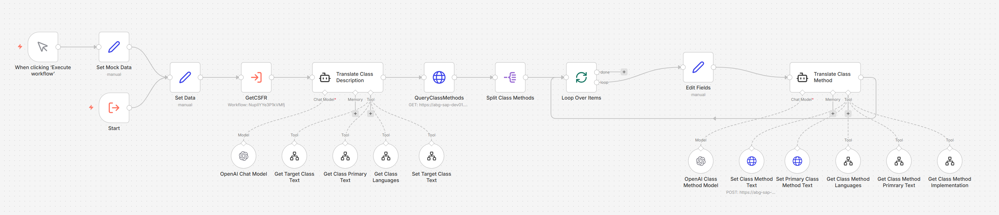
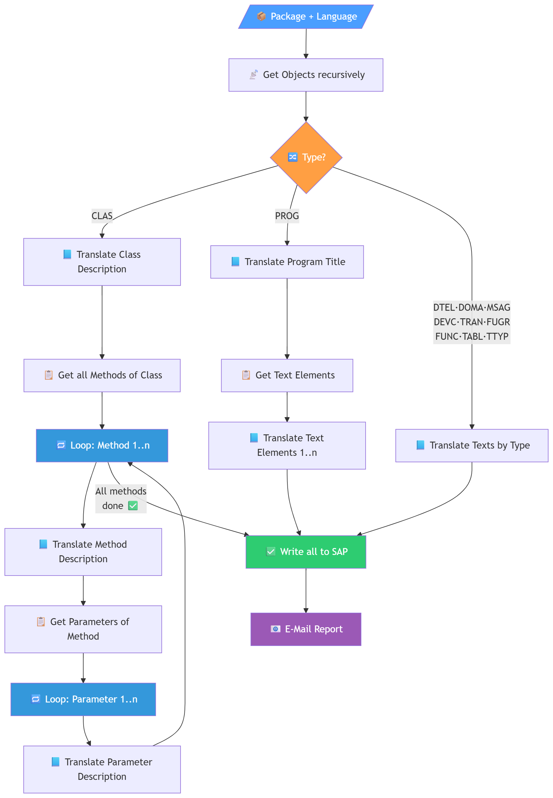
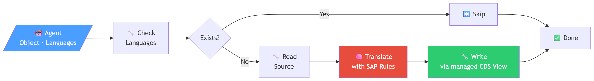
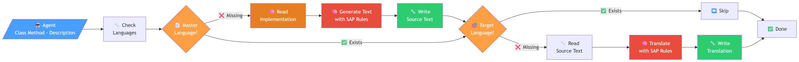

# 📄 Automatic Translation of ABAP Development Objects with AI

Welcome! In this repository you will find all the information and resources to automatically translate ABAP development objects using AI. 🧠📘



## Process descrioton

### Main process



### Sub AI Agent for translation



### Extended Sub AI Agent with initial text generation when text is missing by checking implementation



## 🚀 1. Install Tech Stack

### ⚙️ Node.js 22

Our tech stack requires **Node.js v22**:
➡️ [Download Link](https://nodejs.org/en/download)

💡 **Tip:** Use the `nvm` tool to easily manage multiple Node.js versions.

#### 🪟 Windows

- [Download nvm-windows](https://github.com/coreybutler/nvm-windows)
- Then run in terminal:

```bash
nvm install 22
nvm use 22

#### 🍎 macOS

```Bash
curl -o- https://raw.githubusercontent.com/nvm-sh/nvm/v0.40.3/install.sh | bash
# in lieu of restarting the shell
\. "$HOME/.nvm/nvm.sh"
# Download and install Node.js:
nvm install 22
# Verify the Node.js version:
node -v # Should print "v22.16.0".
nvm current # Should print "v22.16.0".
# Verify npm version:
npm -v # Should print "10.9.2".
```

Local n8n Instance
We use n8n as the central platform for our workflows. More information about n8n: https://n8n.io/.

Recommended installation via npm: https://docs.n8n.io/hosting/installation/npm/

Start and install with:
```
npx n8n
```

Then press "o" in the terminal or navigate to "n8n:local" to open n8n.


### 📦 Install ZSWAN_N8N_TRANSLATION_SRV Service via abapGit
To use this project, you need abapGit. Follow these steps:

1. Install abapGit in your ABAP system.
2. Clone this repository using abapGit.
3. Follow the abapGit instructions to pull and activate the project.

➡️ For more details, refer to the [abapGit Documentation](https://docs.abapgit.org/).

Make sure the package ZSWAN_N8N_TRANSLATION_SRV is available and the service ZSWAN_N8N_TRANSLATION_SRV is active.

Note: If an error occurs indicating that the service (binding or definition) could not be imported, it may need to be created manually.

### 📥 Import n8n workflows from /workflows

This repository includes pre-configured n8n workflows located in the `/workflows` folder. Follow these steps to import them into your local n8n instance:

1. **Open n8n** in your browser (default: `http://localhost:5678`)
2. Navigate to **Workflows** in the left sidebar
3. Click the **⋮** (three dots menu) or **Import** button
4. Select **Import from File**
5. Browse to the `/workflows` folder and import the following workflow files:

| Workflow File | Description |
|---------------|-------------|
| `main.json` | Main orchestration workflow |
| `class.json` | Class translation workflow |
| `get-class-languages.json` | Retrieves available languages for a class |
| `get-class-text.json` | Fetches class text content |
| `create-or-update-class.json` | Creates or updates class translations |
| `get-class-method-languages.json` | Retrieves available languages for class methods |
| `get-class-method-text.json` | Fetches method text content |
| `get-class-method-implementation.json` | Retrieves method implementation details |
| `create-or-update-class-method.json` | Creates or updates method translations |

6. **Configure credentials**: After importing, update the SAP connection credentials and AI service API keys in each workflow
7. **Activate workflows**: Enable the imported workflows by toggling them to "Active"

💡 **Tip:** Start by importing `main.json` first, as it orchestrates the other sub-workflows.

### ❓ Questions?
Feel free to reach out to us: Mario Kernich (mario.kernich@swan.de) or Damien Arriens (damien.arriens@swan.de).

Or open a GitHub issue directly – we appreciate your feedback! 🙌
